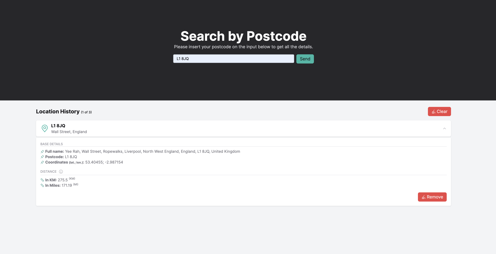

# Find Postcode Details

> This repo contains the code for the **craftable software** technical challlenge
>
> **[Challenge Details](challenge.md)**

## 🛠 Skills

![react][react] ![tailwindcss][tailwindcss] ![typescript][typescript] ![vite][vite] ![react-hook-fomr][react-hook-form]

## 📄 Roadmap

-   [x] Use Tailwind CSS for all the style;
-   [x] Use SVG Sprite for the icons;
-   [x] Use **Axios** for handle the **API** requests;
-   [x] Add **ESLint**, **commitlint** and **Husky** configuration;
-   [x] Use **React Hook Form** with **Zod** to add validations on the form (it's simple, but if we need to add more
        fields already have everything done);
-   [x] Add **Storybook** for components documentation.

### Future Improvements

-   [ ] Add `docker-compose.yaml` and `Dockerfile`, allowing to run the project in **Dev** or **Production** mode.

## 📁 How to run

For running this project you will need to have **Node.js** and **NPM** or **Yarn** installed. After that, please follow the setps below:

1. Copy & Paste the `.env.example` file and rename it for `.env`;
2. Run `npm i` or `yarn` to install the project dependencies;
3. Run project:
    - **Project (Dev Mode):** `npm run dev` or `yarn dev`;
    - **Storybook:** `npm run storybook` or `uarn storybook`.

## 🔗 More About Me

[react]: https://img.shields.io/badge/react-1E4174?style=for-the-badge&logo=react&logoColor=white
[tailwindcss]: https://img.shields.io/badge/tailwindcss-1E4174?style=for-the-badge&logo=tailwindcss&logoColor=white
[typescript]: https://img.shields.io/badge/typescript-1E4174?style=for-the-badge&logo=typescript&logoColor=white
[vite]: https://img.shields.io/badge/vite-1E4174?style=for-the-badge&logo=vite&logoColor=white
[react-hook-form]: https://img.shields.io/badge/react_hook_form-1E4174?style=for-the-badge&logo=reacthookform&logoColor=white
